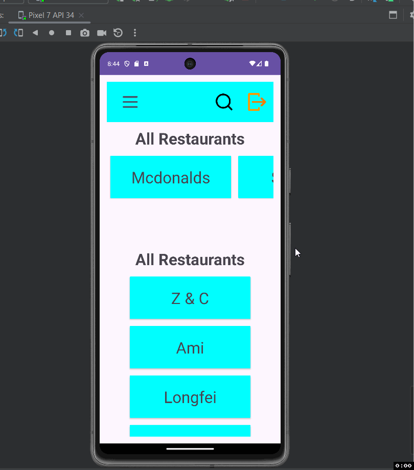

Food Delivery App

Description of the project ...

- The Project is a food delivery application that allows user to order food. Uses firebase for auth, database, and storage.

## Functionality 

The following **required** functionality is completed:

* [ ] Sign in Activity
* [ ] Session Saving with shared Preferences
* [ ] Uploading Image of the user
* [ ] Implementation of Navigation Drawer
* [ ] Implementation of Recent Restaurants in Horizontal Scrollable
manner in Home Activity
* [ ] Implementation of All Restaurants in Vertical Scrollable manner in
Home Activity.
* [ ] README.md
* [ ] ...

The following **extensions** are implemented: 

Firebase Auth, Database, Storage

## Video Walkthrough

Here's a walkthrough of implemented user stories:

GIF created with [LiceCap](http://www.cockos.com/licecap/).

## License

    Copyright [2023] [Andrew Cheng]

    Licensed under the Apache License, Version 2.0 (the "License");
    you may not use this file except in compliance with the License.
    You may obtain a copy of the License at

        http://www.apache.org/licenses/LICENSE-2.0

    Unless required by applicable law or agreed to in writing, software
    distributed under the License is distributed on an "AS IS" BASIS,
    WITHOUT WARRANTIES OR CONDITIONS OF ANY KIND, either express or implied.
    See the License for the specific language governing permissions and
    limitations under the License.
